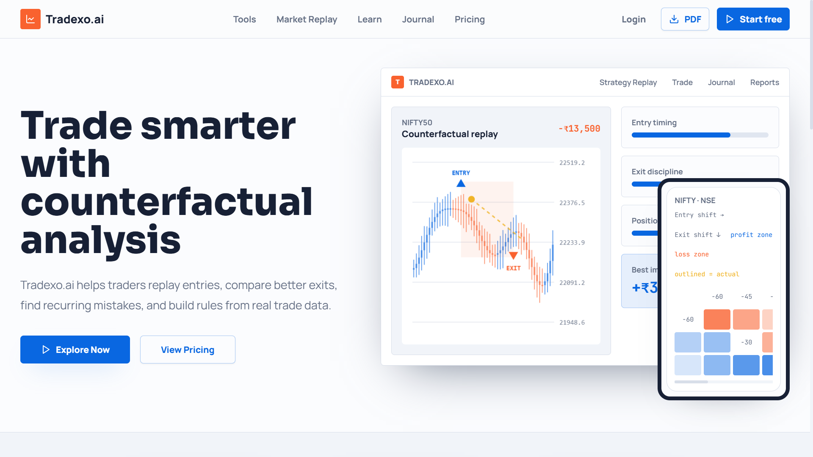
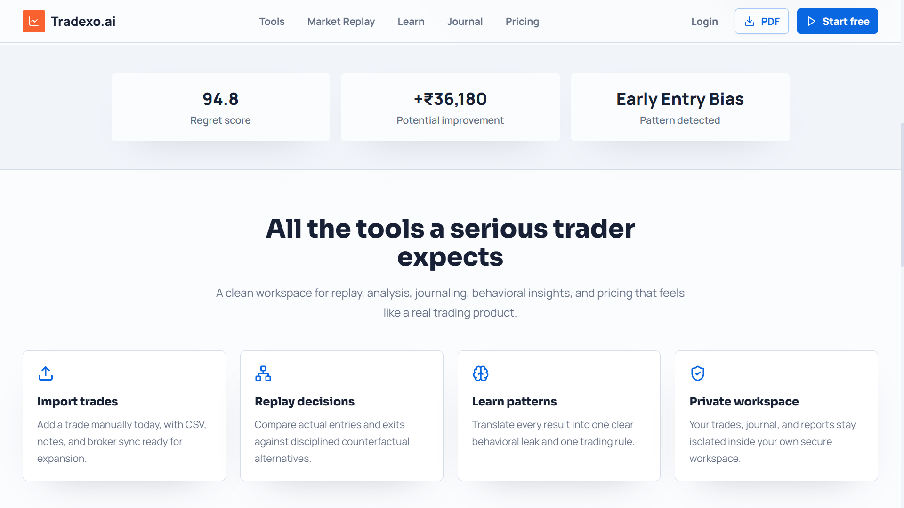
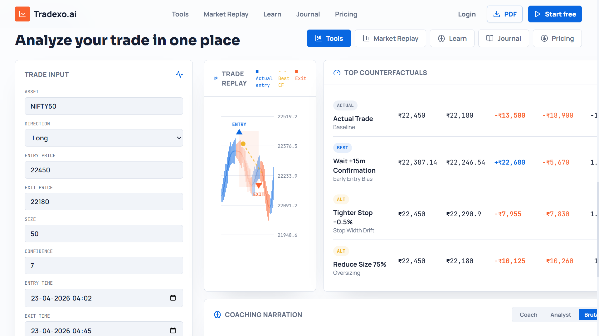
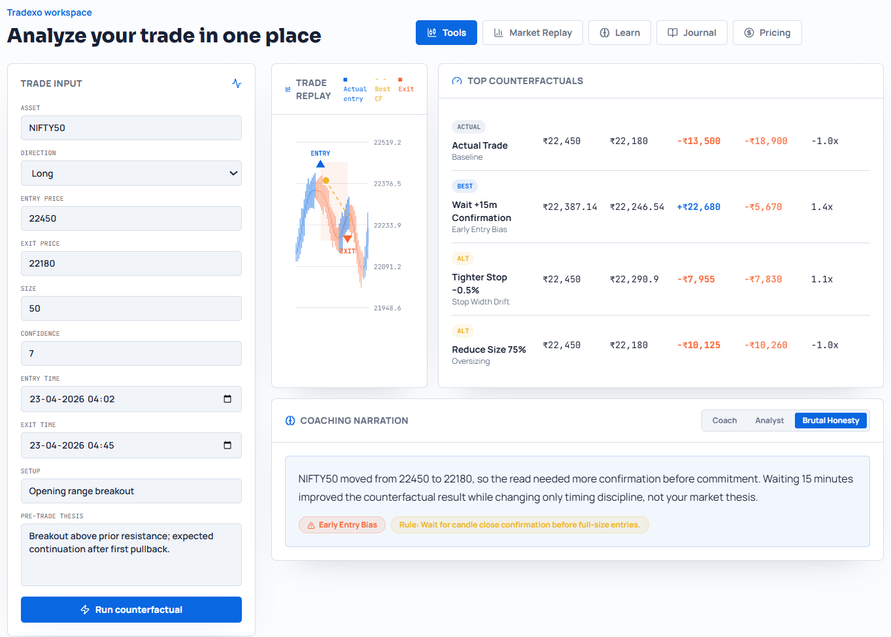
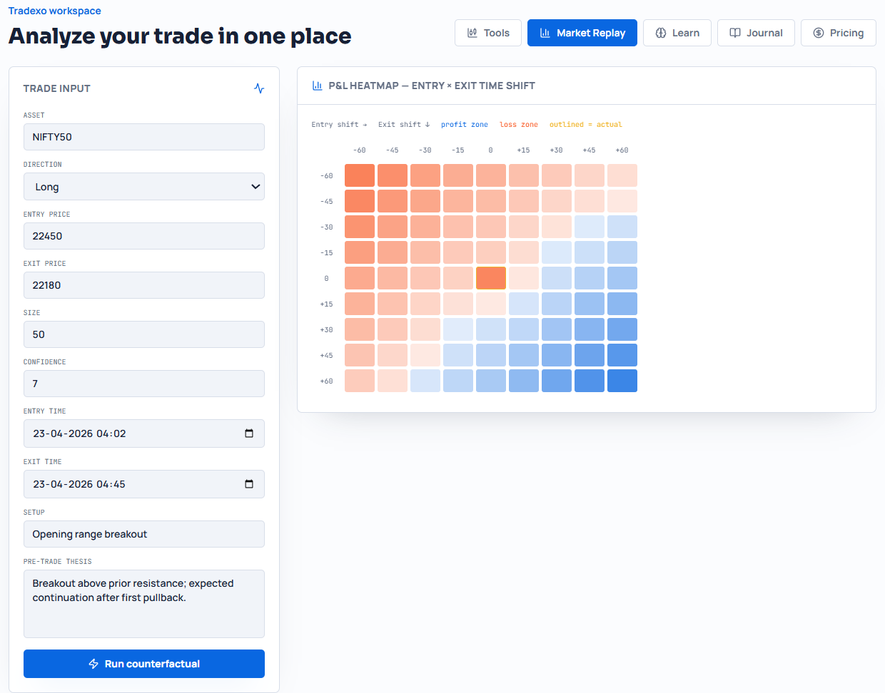
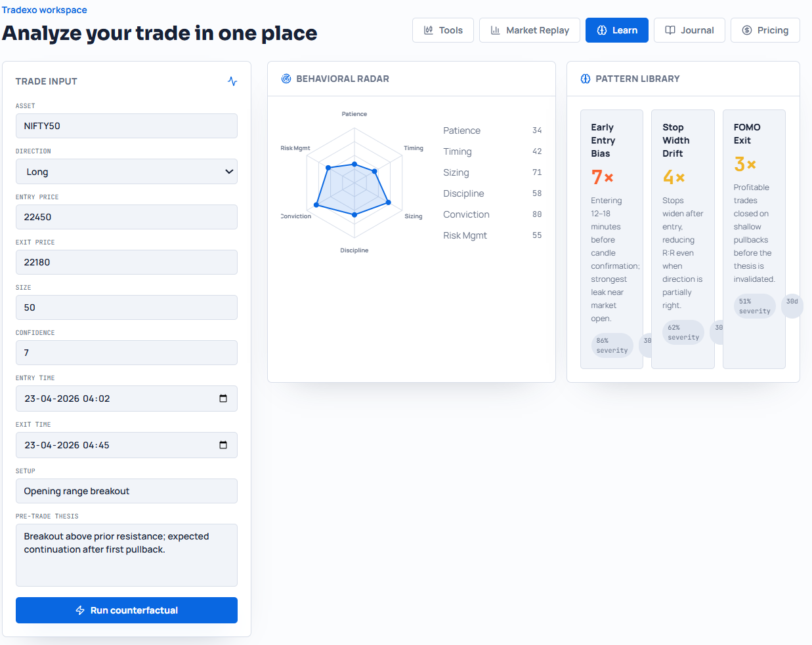
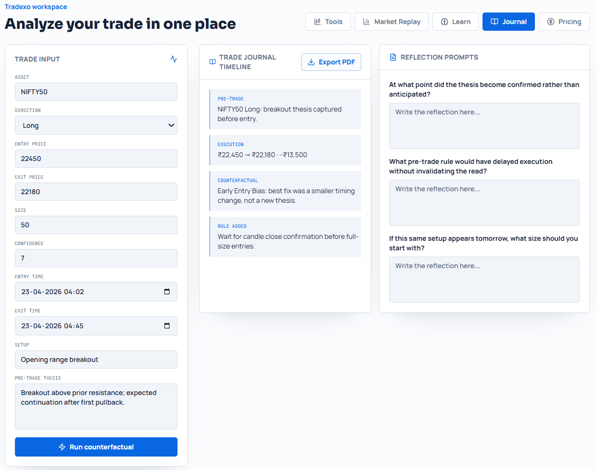
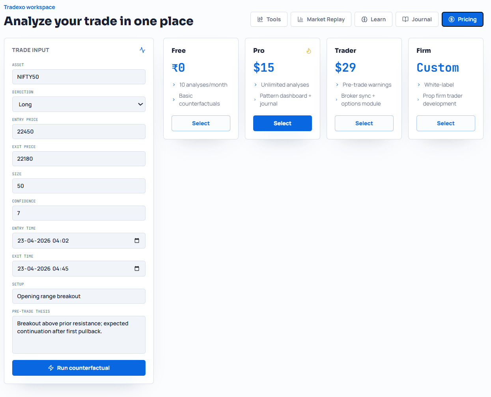

# Tradexo.ai — Trade Smarter with Counterfactual Intelligence



> **Not just tracking trades — improving decisions.**

Tradexo.ai is an AI-powered trading analytics platform that helps traders **replay trades, simulate better decisions, and eliminate behavioral mistakes** using **counterfactual analysis**.
---
##  UI Preview

<details>
<summary>Click to view screenshots</summary>

<br>










</details>

## What Makes This Different?

Most tools answer:
> *“What happened?”*

Tradexo answers:
> **“What should you have done instead?”**

It bridges the gap between **execution** and **decision quality**.

---

##  Core Idea: Counterfactual Analysis

Instead of just analyzing your trade, Tradexo generates **alternate scenarios**:

- What if you entered later?
- What if you exited earlier?
- What if you reduced position size?
- What if you waited for confirmation?

This transforms trading from guessing → **data-driven learning**

---

## Features

### Trade Replay Engine
- Visual replay of your trade on chart  
- Compare actual vs optimal entry/exit  
- Identify timing inefficiencies  

---
### P&L Heatmap (Entry vs Exit Timing)


- Entry shift vs Exit shift grid  
- Blue = profit zone  
- Red = loss zone  
- Quickly find optimal decision window  

---

### Behavioral Analytics


Detect patterns like:
- Early Entry Bias  
- FOMO Exit  
- Overconfidence  
- Poor Risk Management  

---

### Counterfactual Scenarios


Examples:
- Wait +15 minutes → Better confirmation  
- Reduce size → Lower risk  
- Tighter stop → Better control  

---

### Trade Journal + Reflection


- Timeline of trade lifecycle  
- Reflection prompts  
- Rule-building system  

---

### AI Coaching Narration

Example insight:

> “Waiting 15 minutes would have converted a ₹13,500 loss into ₹9,180 profit.”

---

## How It Works

### Step 1 — Input Trade

### Step 2 — Run Counterfactual Engine
- Simulates alternate decisions  
- Evaluates outcomes  

### Step 3 — Analyze Results
- Heatmaps  
- P&L comparison  
- Behavioral insights  

### Step 4 — Improve Strategy
- Extract rules  
- Apply in future trades  

---
## Agents
```
| # | Agent | Role |
|---|-------|------|
| 1 | **Ingestion Agent** | Validates & normalizes trade input |
| 2 | **Market Data Agent** | Fetches OHLCV data via Yahoo Finance |
| 3 | **Simulation Agent** | Generates parameter grid (1,620 combos) |
| 4 | **Parallel Agent** | Distributes simulations across CPU cores |
| 5 | **Aggregation Agent** | Builds heatmaps, rankings, metrics |
| 6 | **Pattern Agent** | Detects behavioral mistakes |
| 7 | **LLM Agent** | Generates coaching via HuggingFace |
| 8 | **API Agent** | FastAPI endpoints |
| 9 | **Storage Agent** | Database persistence |
```

## Architecture
```
┌─────────────────────────────────────────────────────────┐
│                    FastAPI (API Agent)                  │
├────────┬────────┬──────────┬──────────┬────────┬────────┤
│Ingest  │Market  │Simulation│ Parallel │Pattern │  LLM   │
│Agent   │Data    │Agent     │ Agent    │Agent   │ Agent  │
│        │Agent   │          │(Workers) │        │(HF API)│
├────────┴────────┴──────────┴──────────┴────────┴────────┤
│              Storage Agent (SQLite/PostgreSQL)          │
└─────────────────────────────────────────────────────────┘
```

---

## Tech Stack

**Frontend**
- React / Next.js  
- TailwindCSS  
- Recharts / Chart.js  

**Backend (Optional / Planned)**
- Node.js / Express  
- Python (ML / analytics)  

**Core**
- Counterfactual simulation engine  
- Time-series analysis  
- Rule-based + ML hybrid logic  

---


## Quick Start

### 1. Install Dependencies
```bash
cd "Quant project"
pip install -r requirements.txt
```

### 2. Configure Environment
```bash
cp .env.example .env
# Edit .env and add your HF_API_TOKEN
```

### 3. Start the Server
```bash
python -m backend.main
```

### 4. Submit a Trade
```bash
curl -X POST http://localhost:8000/api/v1/submit-trade \
  -H "Content-Type: application/json" \
  -d '{
    "asset": "AAPL",
    "direction": "long",
    "entry_time": "2026-04-20T10:30:00",
    "exit_time": "2026-04-20T14:00:00",
    "size": 100
  }'
```

### 5. Get Results
```bash
curl http://localhost:8000/api/v1/results/{trade_id}
```
##  Example Insight

| Case | Result |
|------|--------|
| Actual Trade | ❌ -₹13,500 |
| With Confirmation | ✅ +₹9,180 |

---

## Behavioral Patterns

- Early Entry Bias  
- Stop Loss Drift  
- FOMO Exit  
- Oversizing  

---
## Vision

To build the **decision intelligence layer for traders**  
where every trade becomes a **learning loop**.

---

## ⚠️ Disclaimer

This project is for **educational purposes only**.  
Trading involves financial risk.

---

## Contributing

---

##  Contact

- GitHub: https://github.com/Aditya001-max  
- Project: https://github.com/Aditya001-max/Tradexo.ai  

---
